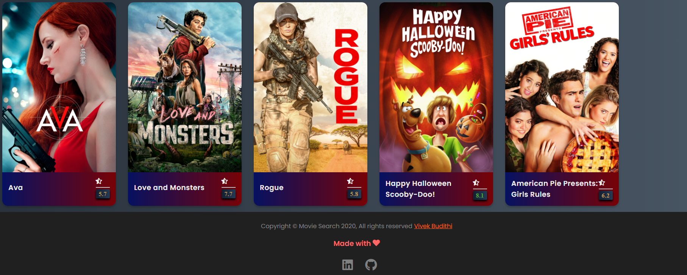

# Movies search App

A Web Application built to search your favourite movie, view the ratings and an overview of the movie. It is built using HTML, CSS and VanillaJs.

 

## API

API Movie Search Resource - **[Devlopers API](https://developers.themoviedb.org/3/getting-started/introduction)**

## Web App Output
The Movie Search website deployed in Netlify - **[Movie Search Website](https://vivek-movie-search.netlify.app/)**

## How to use

- Fork and clone the repository.
- Open in the live sever or just open the index.html.

LinkedIn Profile - **[Vivek Budithi](https://www.linkedin.com/in/vivek-budithi-a27321151/)**  
